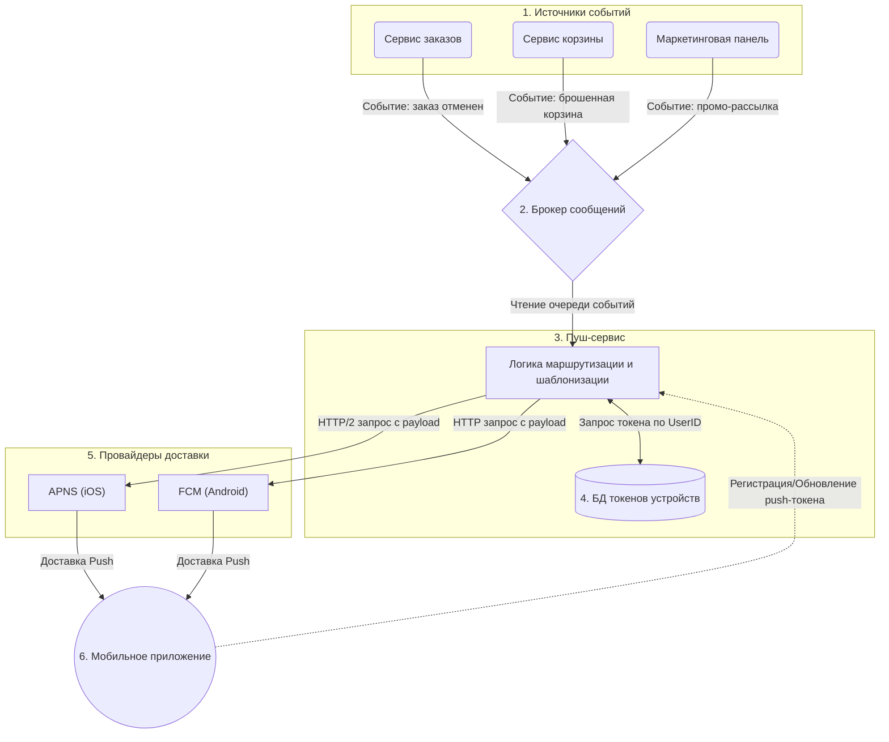

##  ***Задание 1.***
#### **I. Логические противоречия и недочеты.**
1) В пункте 7 говорится, что цена фиксируется в момент добавления и не меняется. Пункт 13 утверждает, что система должна автоматически обновлять цену, если она изменилась в каталоге. Это взаимоисключающие требования. Система не может одновременно фиксировать цену и динамически её обновлять.
2) В пункте 2 сказано, что количество можно изменить не менее чем до 1, а для удаления есть отдельная кнопка. В пункте 9 сказано, что товар удаляется, если уменьшить его количество до 0. Если система не позволяет спустить счетчик ниже 1, то условие из пункта 9 никогда не сможет быть выполнено.
3)  Пункт 10 говорит, что реклама может быть (опциональность). Пункт 11 заявляет, что она должна быть в будние дни (обязательность). 
4) Понятия "утро" и "вечер" в пункте 11 не являются техническими. Отсутствуют конкретные временные рамки (например, с 06:00 до 12:00) и не указан часовой пояс.
5) При превышении лимитов показывается единое сообщение "Лимит корзины превышен", но всего обозначено три лимита - максимум 10 шт. одного товара (пункт 1), максимум 5 разных товаров (пункт 3) и максимум 20 товаров всего (пункт 4). Единое сообщение не дает пользователю понимания, какой именно лимит он нарушил и как это исправить.
6) В списке отображаемых элементов корзины указаны детали по каждой позиции, но забыт самый важный элемент для интернет-магазина — итоговая сумма всей корзины.
7) В списке пропущен пункт №12. За пунктом 11 сразу идет 13.
#### **II. Скорректированная версия ТЗ**
1) Пользователь может добавить в корзину от 1 до 10 единиц (штук) одного наименования товара. Шаг изменения количества для штучных товаров равен 1. 
2) Пользователь может изменять количество товара в корзине. Уменьшение количества товара до 0 приводит к его автоматическому удалению из корзины. Также для каждого товара предусмотрена отдельная кнопка "Удалить".
3) В корзине может находиться не более 5 уникальных наименований товаров.
4) Суммарное количество всех единиц товаров в корзине не может превышать 20 штук.
5) При попытке превысить любой из лимитов система блокирует действие и показывает специфицированное уведомление:
    - При превышении лимита на 1 товар: "Максимальное количество этого товара — 10 шт."
    - При превышении уникальных товаров: "В корзину можно добавить не более 5 разных товаров."
    - При превышении общего количества: "Общее количество товаров в корзине не может превышать 20 шт."
6) Цена на товары в корзине не фиксируется. Если цена товара изменяется в каталоге, она автоматически обновляется в корзине пользователя. При изменении цены система должна отобразить информационное сообщение в корзине: "Цена на некоторые товары изменилась".
7) На странице корзины для каждой позиции отображается: наименование, количество, цена за единицу, общая стоимость позиции. Внизу страницы отображается итоговая сумма всей корзины и общее количество товаров.
8) В интерфейсе корзины предусмотрен блок для рекламы сопутствующих товаров. Реклама отображается строго по будним дням (Пн-Пт) в периоды с 06:00 до 11:59 ("утро") и с 18:00 до 23:59 ("вечер") по московскому времени (UTC+3). В остальное время рекламный блок скрыт.

#### **III. Вопросы для ПМ/Заказчика**
- Магазин "Петрушка Зеленая" продает только штучные товары или есть весовые (овощи/фрукты)? Если есть весовые, нужно ли адаптировать лимиты (возможность купить 0.5 кг)?
- С чем связаны такие жесткие лимиты (всего 5 разных товаров и 20 штук в сумме)? Это техническое ограничение интеграции с ERP/кассой, или защита от оптовиков? Что делать, если клиент хочет сделать большой заказ на праздник?
- Что должно происходить, если пользователь добавил товар в корзину, ушел думать на час, а за это время товар закончился на складе? Резервируется ли товар в момент добавления в корзину? Если нет, как мы уведомляем пользователя о том, что товара больше нет?
- По какому часовому поясу определяется "утро" и "вечер"? По времени устройства пользователя или по времени сервера работы магазина?
- Корзина должна быть привязана к устройству или к аккаунту пользователя (сохраняться в БД и быть доступной с телефона и ПК при авторизации)?


## ***Задание 2***
#### **1) Пример REST API запроса.**
- Поскольку время доставки напрямую зависит от местоположения пользователя, предлагается передавать текущие координаты в параметрах запроса. 

```html
GET /api/v1/partners?lat=55.755814&lon=37.617635 HTTP/1.1
Host: api.green-petrushka.ru
Authorization: Bearer <user_access_token>
Accept: application/json
```
#### **2) Формат ответа**

```json
{
  "data": [
    {
      "id": 101,
      "name": "METRO",
      "logo_url": "https://cdn.green-petrushka.ru/partners/metro_logo.png",
      "external_link": "https://metro.ru/catalog/",
      "delivery_info": {
        "title": "Ближайшая доставка",
        "time_text": "сегодня 21:00-23:00",
        "type": "scheduled"
      }
    },
    {
      "id": 102,
      "name": "Ашан",
      "logo_url": "https://cdn.green-petrushka.ru/partners/auchan_logo.png",
      "external_link": "https://auchan.ru/grocery/",
      "delivery_info": {
        "title": "Ближайшая доставка",
        "time_text": "сегодня 18:00-20:00",
        "type": "scheduled"
      }
    },
    {
      "id": 103,
      "name": "ВкусВилл",
      "logo_url": "https://cdn.green-petrushka.ru/partners/vkusvill_logo.png",
      "external_link": "https://vkusvill.ru/",
      "delivery_info": {
        "title": "Быстрая доставка",
        "time_text": "от 20 до 60 минут",
        "type": "express"
      }
    },
    {
      "id": 104,
      "name": "ВИКТОРИЯ",
      "logo_url": "https://cdn.green-petrushka.ru/partners/victoria_logo.png",
      "external_link": "https://victoria-group.ru/",
      "delivery_info": {
        "title": "Ближайшая доставка",
        "time_text": "сегодня 17:00-19:00",
        "type": "scheduled"
      }
    }
  ],
  "meta": {
    "total_count": 4
  }
}
```

## ***Задание 3***


